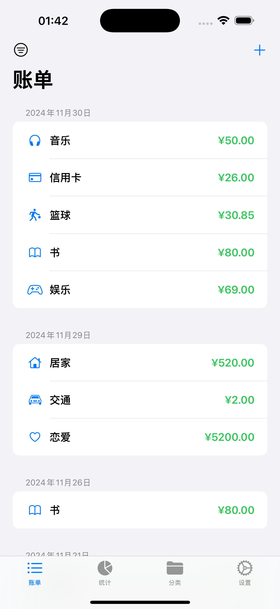
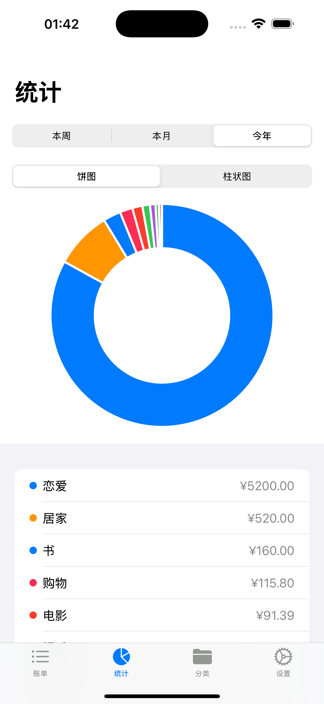
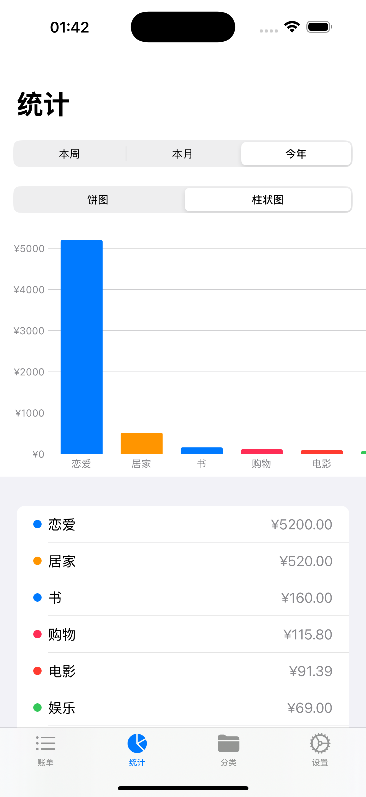

# Ledger - iOS记账应用
 <div style="display:flex">
   
   
   
</div>
<br>

一个使用 SwiftUI 开发的简洁美观的个人记账应用

## 功能特点

### 1. 交易记录管理
- 支持添加、编辑和删除交易记录
- 按日期分组显示交易记录
- 支持备注和日期选择
- 支持左滑快速操作（编辑/删除）

### 2. 分类管理
- 预设常用分类（餐饮、交通、购物等）
- 支持自定义分类和图标
- 支持拖拽排序
- 分类顺序在所有视图中保持一致

### 3. 数据统计
- 支持饼图和柱状图展示
- 可按周、月、年查看消费统计
- 支持分类筛选和时间范围筛选
- 图表支持动画效果和交互

### 4. 数据管理
- 使用 Core Data 进行本地数据存储
- 支持数据备份和恢复
- 无需网络连接，保护隐私

### 5. 用户界面
- 支持深色模式
- 符合 iOS 设计规范
- 流畅的动画和过渡效果
- 支持键盘自动处理

## 技术特点

- **框架**: SwiftUI
- **数据存储**: Core Data
- **最低支持版本**: iOS 15.0
- **开发工具**: Xcode 15.0+

## 项目结构

```
Ledger/
├── Models/
│   ├── LedgerModel.xcdatamodeld    // Core Data 模型
│   ├── DataManager.swift           // 数据管理器
│   ├── RefreshTrigger.swift        // 数据刷新触发器
│   └── EnvironmentValues+Extension.swift
├── Views/
│   ├── ContentView.swift           // 主视图
│   ├── TransactionListView.swift   // 交易列表
│   ├── AddTransactionView.swift    // 添加交易
│   ├── TransactionDetailView.swift // 交易详情
│   ├── CategoryManageView.swift    // 分类管理
│   ├── StatisticsView.swift        // 统计图表
│   └── SettingsView.swift          // 设置
└── Utils/
    └── KeyboardDismissModifier.swift // 键盘处理工具
```

## 安全性

- 所有数据存储在本地，不需要网络连接
- 不收集任何用户信息
- 支持系统级数据备份

## 使用说明

1. **添加交易**
   - 点击主页面右上角的"+"按钮
   - 输入金额、选择分类
   - 可选择添加备注和修改日期

2. **管理分类**
   - 在分类管理页面可以添加、编辑、删除分类
   - 长按拖动可以调整分类顺序
   - 支持自定义分类图标

3. **查看统计**
   - 切换饼图/柱状图展示消费分布
   - 选择不同时间范围查看统计
   - 点击分类可以筛选显示

4. **数据备份**
   - 在设置页面可以导出数据
   - 支持导入之前备份的数据


## 注意事项

- 首次启动会自动创建默认分类
- 删除分类或交易记录时会有二次确认
- 建议定期备份重要数据
